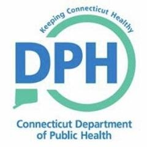

Accidental drug-related deaths are an ongoing public health concern at a national level, and in the state of Connecticut in particular. Opioid overdose deaths in Connecticut has doubled over the past six years, largely driven by the recreational use of a combination of multiple drugs. The motivation for this project is to analyze and report on local geogographic and demographic trends related to drug overdose deaths in recent years. 

### **Dataset**

For this assessment, the [Accidental Drug Related Deaths 2012-2018](https://catalog.data.gov/dataset/accidental-drug-related-deaths-january-2012-sept-2015) dataset was utilized. This data was originally derived from an investigation by the Connecticut Office of the Chief Medical Examiner which includes the toxicity report, death certificate, as well as a scene investigation.

### **Findings**

### **Website Overview**

**Contributers: Connie Zhang, Laura Lynch, Rachel Crowley, Ekta Chaudhary, Tiana Ouyang**
